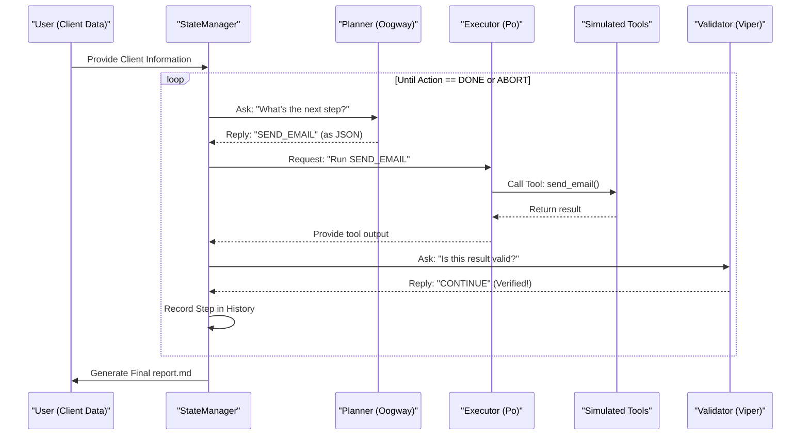

# Agent Flow Diagram

## 🐚 The Planner (Oogway)
The brain of the system, thinking step by step.

## 🐼 The Executor (Po)
The action center, transforming ideas into reality.

## 🐍 The Validator (Viper)
The safety net, ensuring every result is perfect.

## 🔁 Agent Flow Sequence

## 🧠 Decision Examples

### Case 1: Standard Success
Planner: SEND_EMAIL
Executor: SUCCESS
Validator: CONTINUE

### Case 2: Missing Critical Data
Planner: SEND_EMAIL (thinking the data exists)
Executor: ERROR: Email is null
Validator: ABORT: Missing critical info

### Case 3: Duplicate Client
Planner: CREATE_AIRTABLE_RECORD
Executor: SUCCESS (record exists)
Validator: CONTINUE (triggers warning, but doesn't stop)
